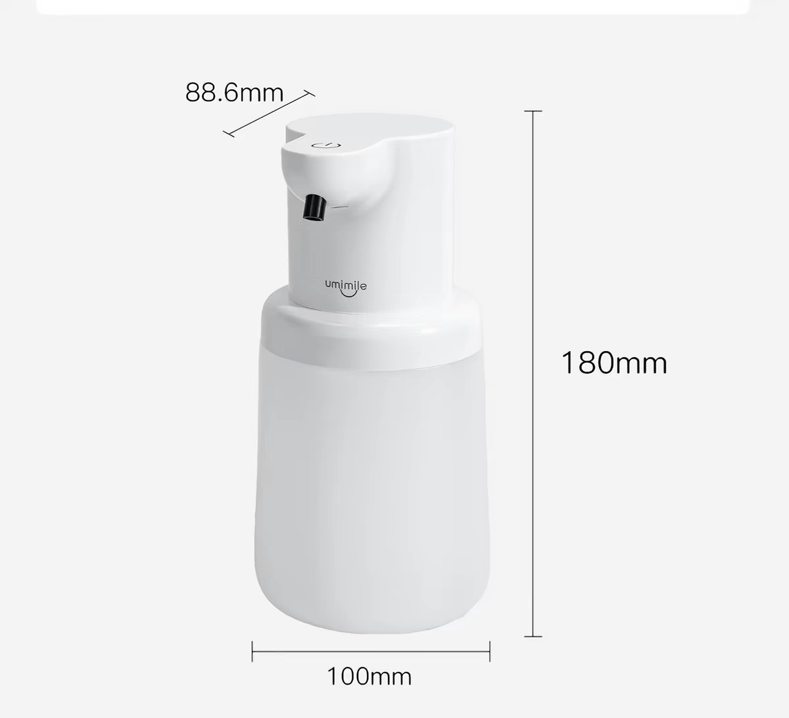
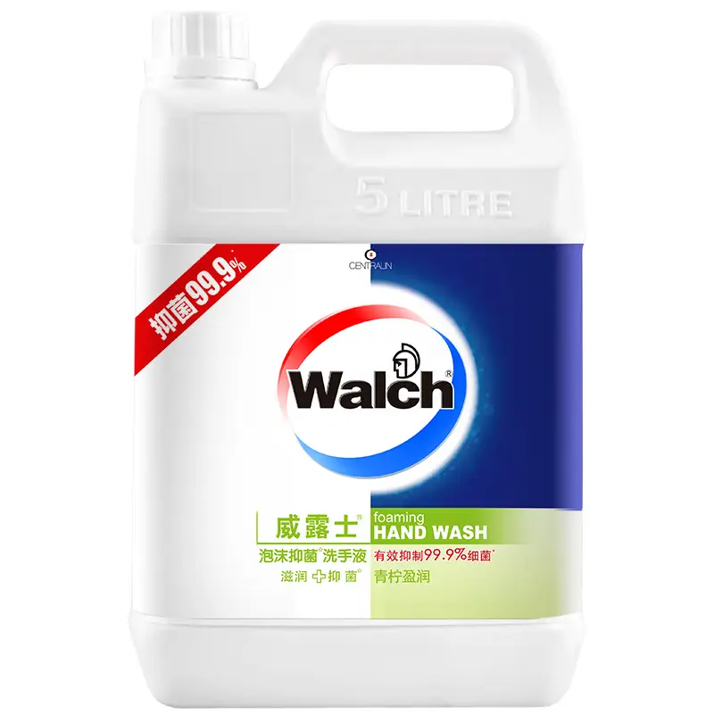

今天无意中发现了一件已经陪了自己两三年的东西 —— 感应洗手液机

自从有了这个东西之后，我从之前想起来偶尔用一用洗手液的程度，到了现在洗手的时候会下意识手伸过去扫一坨洗手液仔细洗手的程度

其实再之前也有买过那种按压式的洗手液，但是因为多了个步骤，而且有时候手脏的时候就不会想按那个泵头，或者按的多了感觉那个泵头比我手都脏。所以后来就很少用了。  
直到后来是在刷 **羊SheepKep** 某一期好物推荐的视频的时候，看到他推荐了这种感应洗手机，当时他用的是小米的一款，但是那个还要买专门的洗手液替换装，因为这种已经是比较成熟的品类了，所以我后来从淘宝上找了一款类似功能的，但是又能自己换洗手液的。  
除了需要一个月左右补充一次洗手液，三个月左右给洗手液机充一次电之外，他几乎已经完美融入我的卫生间了，我把它挂在了洗手台的旁边，每次洗手的时候顺便把手伸到洗手液机下面，它会定量挤出一坨洗手液泡沫，既不用担心手搞脏机器，也不怕摸到黏黏糊糊的积攒的洗手液，现在这已经成为了一种下意识的习惯了，而且算是一个百利无一害的好习惯

关于替换装，我一般是直接买一大桶，比如像是下面这种5L装的，即便是已经很频繁洗手了，我一个人也能用一年多才能用完  

