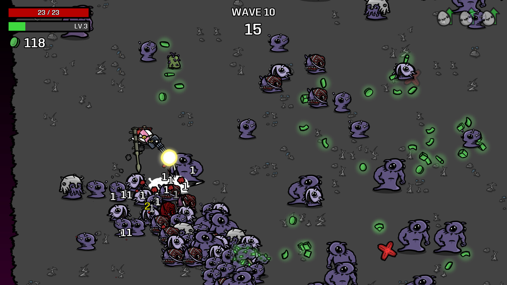

在好几年前某一次 Steam 促销的时候，买了一个 [土豆兄弟](https://store.steampowered.com/app/1942280/Brotato/)，但是当时一直玩不来这类游戏，所以玩了没几个小时就卸载闲置了，直到最近在忙碌的工作间隙突然想玩点游戏休息一下。唯一的一个要求就是不能太耗时间，并且能够想停就停。然后就在游戏库存里又翻到了土豆兄弟。

## 土豆兄弟（五⭐推荐）

土豆兄弟算是个刷怪的 rougelike 游戏，有限关卡的模式下每局共有 20 关，需要你结合角色的特性选择合适的属性以及武器搭配通关。整个游戏的节奏比较快，如果只按通20关，不进无尽模式（虽然还从来没玩过无尽模式）的话，大概十来分钟就可以，如果半途被打死了时间就更短了😂。

这次再玩的时候，没想到突然打的有点上头了，每天吃完饭都要来两把。吃完饭打两把刚好休息半个小时接着起来搬砖，时间卡的刚刚好。到现在已经是 92 小时的游戏时长了，但是仍然没玩腻，只要有时间还是想开两把，对我来说这个游戏的主线激励就是在 难度4 下能用全角色通关，目前的进度是仍有大概 5 个角色尚未解锁，难度4 通关的角色占比大概 40%。等到所有角色 难度4 通关之后可能想玩的劲头就没有现在这么高了

顺便一提，这个游戏默认情况下直接解锁了五个难度，满足一定条件之后可以解锁更高的噩梦难度。难度5 感觉对我来说也是有点太难了，4 刚刚好处在我能接受的最高难度上，难，但是努力也能通关

土豆兄弟目前出了好几十个角色了，但是每个角色都做出了专属的一些属性设计，这也是这个游戏这么吸引人，并且能玩这么久都不腻的一个非常重要的原因

> 这个游戏同时还出了一个 深海魔怪 的 DLC，玩了一下并没有感觉和本体有什么大的区别，不买的话也没什么影响

## 吸血鬼幸存者（4.5⭐推荐）

也是在玩了土豆兄弟之后，又趁着最近夏促，在 Steam 上找了下有没有类似的游戏，最终找到了这个品类的鼻祖，或者说是最初把这个品类发扬光大的一个游戏 [吸血鬼幸存者](https://store.steampowered.com/app/1794680/Vampire_Survivors/)。

  

整个游戏画面看起来没有土豆兄弟那么精致，有种以前 FC游戏机 上游戏的感觉了

幸存者的模式和土豆兄弟基本类似，不过这里就没有什么一局n个关卡的概念了，一局就只有一个关卡，但是一个关卡可能会有多个阶段，每个阶段可能会出现不同的 BOSS 或者事件，也是同样的打怪攒经验，经验值满之后可以选择武器或者属性升级。这个游戏目前玩了大概四五个小时，虽然也是好玩的，但是每局都类似无尽模式，没有一个目标，就是一直往前，一直升级，直到自己的战力已经完全打不过逐渐加强并且铺满整个屏幕的怪物的时候，至死方休

如果以战死为目标，那一把下来至少要半个小时以上了，但是好不容易升了一身属性，又不想主动送死，所以打的略微有点难受。之后应该还会玩，但应该只会在时间充裕的时候偶尔玩一下了
